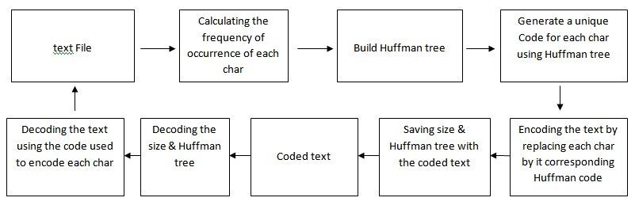

### __Introduction__
In computer science a lot of data is encoded to be used efficiently,
to be avle to give instructions to a computer to carry out information must be passed as bits (i.e 1's and 0's).
 So, movies, Video games, photographs, text and more are encoded as strigs of bits in a computer,
 and when dealing with those strings computers execute billions of instructions per second (a movie depending on the
 quality nd size can be billions of bits of data).
 So an effiecient method for comprition is needed to encode data without losing information
### __FUNCTIONS__

FUNCTION | DESCRIBTION
--------- | ------------
createNode | creat node
createfreqtree | creat frequency tree
createHuffmantree | creat huffman tree 
encode | encoding the text 
printhuffmanCode | printig huffman code 
printVecof_bool  |
fromvectostr  |
Encode_atext  |
decode   | decoding the text 
fromstrtovec |
decoded_totext|

### __A SIMPLE BLOCK DAIGRAM:__

