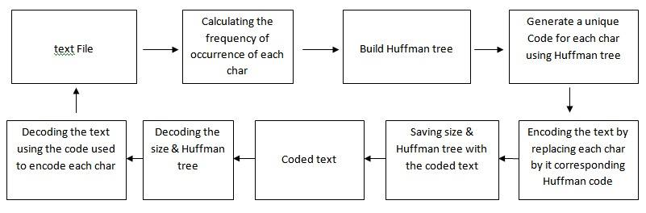

### __FUNCTIONS__

List of handmade structs used:
* Node: just a normal tree node but holds 2 variables a charactar and integer.
* strings:will be the main input and output of our functions.
* unordered map:used to create the structure of huffman tree.
* priority queue:will be used to organize the unordered map.
* bool vectors:will be used to holds the set of encrypted text by using "true" and "false" as "1"& "0".
* comp: a struct built to help our priority queue to organize the map.

Basic functions:
FUNCTION | DESCRIBTION
--------- | ------------
createNode | creat a tree node.

Functions of encryption:

FUNCTION | DESCRIBTION
--------- | ------------
Encode_atext  |the main function of encryption.
createfreqtree | creat frequency tree "a map which have a key of specific char and value of it's frequancy in the main text"
createHuffmantree | creat huffman tree "using priority queue to organize the freqtree .Then taking the least 2 freq and make the a child of a new node with a freq = sum of the 2 least freq and iterate until there is one node in the queue"
createHuffmancodes | create a map of keys as the char used in the text and values as vector of bools expresing the place of the node in the huffman tree.
encode | takes the original text and create a vector of bools as the output using the Huffmancodes tree
printhuffmanCode | printing huffmancodes map each keyy with it's value. 
printVecof_bool  |print the output vector of "encode" as a string of 1 and 0.
fromvectostr  |takes the vector of bools and transfer it to string of char (every 8 bools in the vec is transformed to 1 char).
addsizeofvectostr|adding the true size of the vector to the encrypted string.

Functions of decryption:

--------- | ------------
decoded_totext  |the main function of decryption.
getsizeofvecfromstr|git the size of the original vector and delete the size chars.
fromstrtovec |transform the encrypted string to the encrypted vector of bools
decode   | decoding the vector of bools to original string using the huffmantree.

### __A SIMPLE BLOCK DAIGRAM:__

